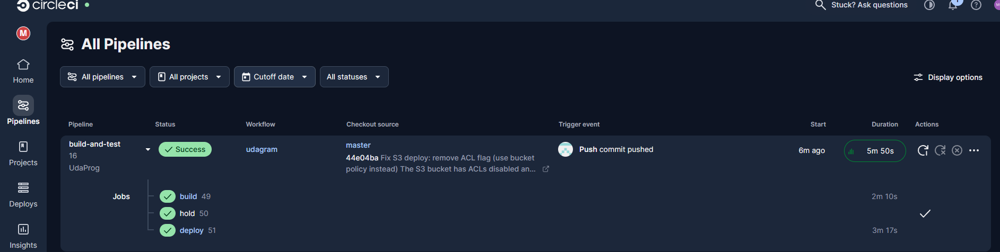
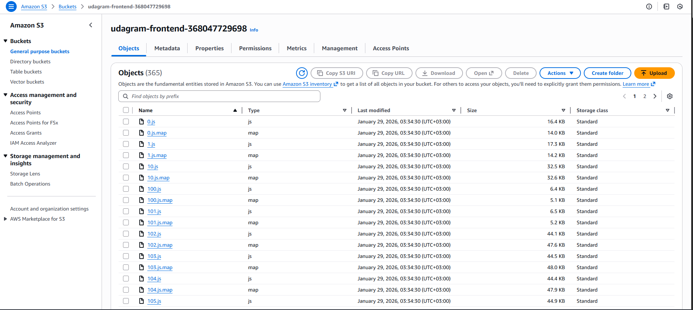

# Udagram - Full-Stack Application Deployment

[](https://circleci.com/gh/YOUR_GITHUB_USERNAME/nd0067-c4-deployment-process-project-starter)

## Project Overview

Udagram is a full-stack image filtering application that allows users to register, log in, post photos to a feed, and process photos using an image filtering service. The application consists of:

- **Frontend**: Angular/Ionic web application
- **Backend**: Node.js/Express RESTful API
- **Database**: PostgreSQL

The application is deployed on AWS using the following services:
- **AWS S3**: Frontend static file hosting
- **AWS Elastic Beanstalk**: Backend API hosting
- **AWS RDS**: PostgreSQL database

## Live Application

**Frontend URL**: http://udagram-frontend-368047729698.s3-website-us-east-1.amazonaws.com

**Backend API URL**: http://udagram-api-dev.eba-3bfwuymm.us-east-1.elasticbeanstalk.com

## Screenshots

### CircleCI Pipeline


### AWS RDS Database


### AWS Elastic Beanstalk


### AWS S3 Bucket


## Dependencies

```
- Node v14.15.1 (LTS)
- npm 6.14.8 (LTS) or more recent
- AWS CLI v2
- EB CLI
- PostgreSQL (AWS RDS)
- S3 bucket for frontend hosting
```

## Installation

### Prerequisites

1. Configure AWS CLI with your credentials:
```bash
aws configure
```

2. Set up environment variables (copy from `udagram/set_env.sh`):
```bash
export POSTGRES_USERNAME=your_db_username
export POSTGRES_PASSWORD=your_db_password
export POSTGRES_HOST=your_rds_endpoint
export POSTGRES_DB=postgres
export AWS_BUCKET=arn:aws:s3:::your-bucket-name
export AWS_REGION=us-east-1
export JWT_SECRET=your_jwt_secret
export URL=http://localhost:8100
```

### Local Development

1. Install root dependencies:
```bash
npm install
```

2. Install and start Backend API:
```bash
cd udagram/udagram-api
npm install
npm run dev
```

3. Install and start Frontend (in new terminal):
```bash
cd udagram/udagram-frontend
npm install -f
ionic serve
```

## Deployment

### Manual Deployment

**Backend (Elastic Beanstalk):**
```bash
cd udagram/udagram-api
npm run build
eb deploy
```

**Frontend (S3):**
```bash
cd udagram/udagram-frontend
npm run deploy
```

### Automated Deployment (CircleCI)

Push to the `master` branch to trigger the CI/CD pipeline:
1. Build job runs automatically
2. Manual approval required for deployment
3. Deploy job pushes to AWS

## Testing

### Frontend Tests
```bash
cd udagram/udagram-frontend
npm run test
npm run e2e
```

## Documentation

- [Infrastructure Description](docs/Infrastructure_description.md)
- [Pipeline Description](docs/Pipeline_description.md)
- [Application Dependencies](docs/Application_dependencies.md)
- [Architecture Diagram](docs/architecture-diagram.md)
- [Pipeline Diagram](docs/pipeline-diagram.md)

## Built With

- [Angular](https://angular.io/) - Single Page Application Framework
- [Ionic](https://ionicframework.com/) - Cross-platform UI toolkit
- [Node.js](https://nodejs.org) - JavaScript Runtime
- [Express](https://expressjs.com/) - JavaScript API Framework
- [PostgreSQL](https://www.postgresql.org/) - Relational Database
- [AWS](https://aws.amazon.com/) - Cloud Services

## License

[License](LICENSE.txt)
