# Architecture Diagram

## High-Level Infrastructure Overview

```mermaid
flowchart TB
    subgraph Users
        U[👤 Users/Browser]
    end

    subgraph Internet
        I[🌐 Internet]
    end

    subgraph AWS["AWS Cloud (us-east-1)"]
        subgraph S3["AWS S3 - Frontend"]
            FE[📦 Angular/Ionic App<br/>Static HTML/CSS/JS<br/>udagram-frontend-368047729698.s3-website-us-east-1.amazonaws.com]
        end

        subgraph EB["AWS Elastic Beanstalk - Backend"]
            API[⚙️ Node.js Express API<br/>RESTful endpoints<br/>Authentication & Image Processing<br/>udagram-api-dev.eba-3bfwuymm.us-east-1.elasticbeanstalk.com]
        end

        subgraph RDS["AWS RDS - Database"]
            DB[(🗄️ PostgreSQL 12+<br/>Users & FeedItems tables<br/>udagram-db.ceqeklx3qssj.us-east-1.rds.amazonaws.com)]
        end
    end

    U --> I
    I --> FE
    I --> API
    FE -.->|API Calls| API
    API -->|Port 5432| DB
```

## Data Flow

1. **User Request**: User accesses the application via browser
2. **Frontend**: S3 serves the Angular/Ionic static files
3. **API Calls**: Frontend makes HTTP requests to the Elastic Beanstalk API
4. **Database**: API communicates with RDS PostgreSQL for data persistence
5. **Response**: Data flows back through the same path to the user

## Creating an Image Diagram

For submission, create an image diagram using one of these tools:

- **draw.io** (diagrams.net) - Free, web-based
- **Lucidchart** - Free tier available
- **AWS Architecture Icons** - Official AWS icons for diagrams

Save the diagram as PNG or PDF in the `docs/screenshots/` folder.
