# Pipeline Diagram

## CI/CD Pipeline Overview

```mermaid
flowchart TD
    subgraph DEV["Developer"]
        D[👨‍💻 Developer<br/>git push]
    end

    subgraph GH["GitHub"]
        G[📦 Repository<br/>Webhook Trigger]
    end

    subgraph CI["CircleCI Pipeline"]
        subgraph BUILD["Build Job"]
            B1[📥 Install Node.js 16]
            B2[📦 Install Dependencies<br/>frontend:install<br/>api:install]
            B3[🔍 Lint Frontend<br/>ng lint]
            B4[🏗️ Build Frontend<br/>ng build]
            B5[🏗️ Build API<br/>tsc compile]
            B1 --> B2 --> B3 --> B4 --> B5
        end

        subgraph HOLD["Hold Job (master only)"]
            H[⏸️ Manual Approval<br/>Review & Approve]
        end

        subgraph DEPLOY["Deploy Job"]
            D1[🔧 Setup EB CLI & AWS CLI]
            D2[🚀 Deploy API<br/>eb deploy → Elastic Beanstalk]
            D3[🚀 Deploy Frontend<br/>aws s3 sync → S3 Bucket]
            D1 --> D2 --> D3
        end
    end

    subgraph AWS["AWS Cloud"]
        EB[⚙️ Elastic Beanstalk<br/>Backend API]
        S3[📦 S3 Bucket<br/>Frontend Static Files]
    end

    D --> G
    G --> BUILD
    BUILD --> HOLD
    HOLD --> DEPLOY
    D2 --> EB
    D3 --> S3
```

## Pipeline Stages Summary

| Stage | Trigger | Actions |
|-------|---------|---------|
| Build | Every push | Install deps, lint, build |
| Hold | Build success (master only) | Manual approval required |
| Deploy | After approval | Deploy to AWS (EB + S3) |

## Creating an Image Diagram

For submission, create an image diagram using:
- **draw.io** (diagrams.net)
- **Lucidchart**

Save as PNG in `docs/screenshots/` folder.
